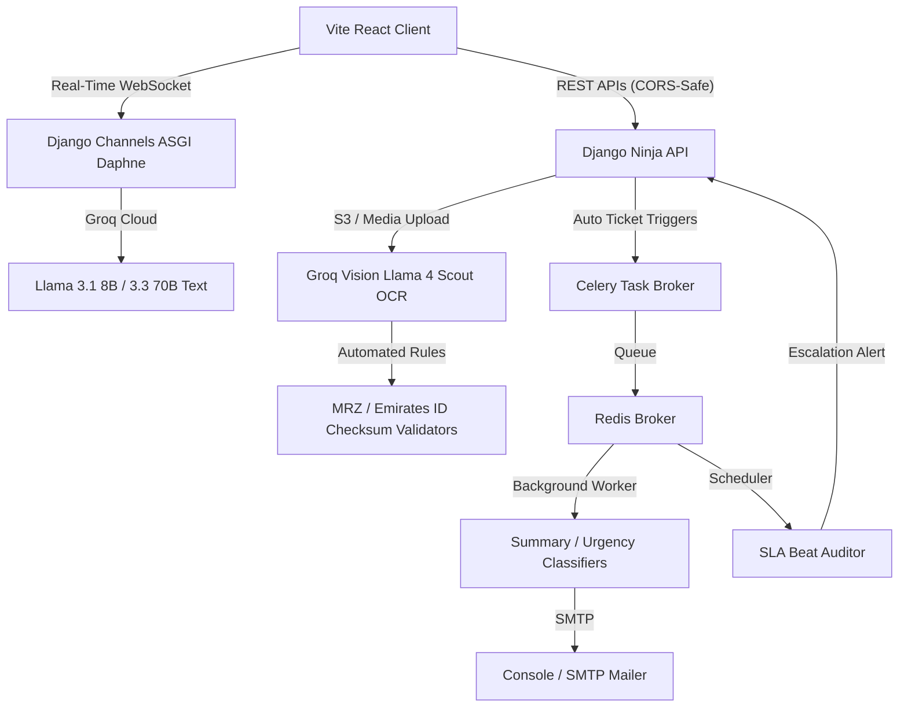

# ⚡ AI-Powered Visa Contact Centre Automation Platform

A complete, production-quality, 100% open-source **AI-powered Contact Centre Automation Platform** designed for a visa/immigration support centre. It manages the entire customer lifecycle: intake $\rightarrow$ stateful slot-filling chat $\rightarrow$ auto-ticket generation $\rightarrow$ Groq Vision OCR document extraction $\rightarrow$ automated priority classification $\rightarrow$ Celery routing $\rightarrow$ SMTP acknowledgment notifications $\rightarrow$ real-time React analytics control panel.

---

## 🏗️ Architectural Topology



---

## ⚡ Key Platform Capabilities

### 1. Stateful AI Slots Chatbot (`Sofia`)
Sofia is a highly disciplined support agent running token-by-token over high-speed WebSockets.
- **Stateful Slot Verification**: Parses user messages to collect mandatory items (e.g. Visa Status enquiry requires Name, Reference Number, and Birth Date). Sofia prompts for **one missing field at a time** to maintain a clean conversational flow.
- **Auto-Ticket Triggers**: Automatically compiles and submits a formal support ticket once all slots are parsed, or if clarification attempts reach a limit of **2 attempts**.
- **Real-Time Streaming**: Dispatches word-by-word streaming text and broadcasts interactive typing indicator states.

### 2. Intelligent Document Processing (OCR)
Direct visual ingestion of Passports, Emirates IDs, and Visa Copies:
- **PIL Grayscale Preprocessing**: Enhances contrast and resolves resolution issues prior to Groq Vision submission.
- **Llama 4 Scout Vision OCR Engine**: Dispatches files to Groq's multimodal OCR node (`meta-llama/llama-4-scout-17b-16e-instruct`) to parse details (Names, Serial Numbers, Nationalities, and Expiry Dates).
- **Automated Checksum Auditing**:
  - **Passports**: Verifies formatting against standard international alphanumeric bounds and audits Machine Readable Zones (MRZ).
  - **Emirates ID Check-Digit**: Implements standard mathematical check digit calculations over the 15-digit UAE EID structure (`784-YYYY-XXXXXXX-Z`) through a weighted mod-10 Luhn checksum:
    $$\sum_{i=1}^{14} (\text{digit}_i \times \text{weight}_i) \pmod{10} = \text{check\_digit}$$
  - **Expiry Checks**: Flags past dates as invalid instantly.

### 3. Celery Ticket Automation & SLA Guards
- **Async Summarizer**: Celery reads multi-turn chat logs and prompts Groq `llama-3.1-8b-instant` to create a concise 2-sentence summary.
- **Urgency Classifier**: Analyzes summaries against strict rules:
  - `critical`: Visa expiry under 7 days, detained travellers, legal/medical emergencies (SLA: 2 hours).
  - `high`: Biometric appointments under 14 days, employer sponsorship issues (SLA: 8 hours).
  - `medium`/`low`: Standard delay enquiries and general information (SLA: 24/72 hours).
- **SLA Beat Auditor**: A periodic worker scanning active tickets every 30 minutes. If a ticket exceeds its SLA deadline, it is automatically marked as `escalated`, logged, and supervisor email alerts are fired.

### 4. Interactive Glassmorphic Dashboard
A visually stunning operational terminal:
- **KPI Indicators**: Displays volume today, active open states, escalated breached items, CSATs, and OCR rejection metrics.
- **Vector Graphics**: Integrates Recharts Line charts (trends), Bar charts (categories), and Donut charts (priority distributions) inside animated cards.
- **Agent Workspace**: Inspect ticket details, assign operational teams, update statuses, or perform manual manager escalations.

---

## 🛠️ Folder & Code Structure

```
Voice_And_ChatBot/
├── backend/
│   ├── core/                    # Settings, ASGI, routing, Celery, and Groq client config
│   ├── tickets/                 # Customer, Ticket models, CRUD APIs, and Celery tasks
│   ├── chatbot/                 # Message, Conversation models, WebSockets, intent / FAQ engines
│   ├── documents/               # Document models, OCR pipelines, and Checksum validators
│   ├── analytics/               # Aggregation API and live socket broadcasters
│   ├── requirements.txt         # Django, Channels, Celery, Groq and PIL packages
│   └── manage.py                # Django execution entrypoint
├── frontend/
│   ├── src/
│   │   ├── pages/               # DashboardPage, ChatPage, TicketPage, DocumentUploadPage
│   │   ├── store/               # Zustand useStore.ts central global state store
│   │   ├── App.tsx              # Sidebar navigation wrapper
│   │   ├── index.css            # Stylesheets, custom scrollbars, and animations
│   │   └── main.tsx             # React bootstrap mounting file
│   ├── index.html               # Main frame importing Inter and Outfit fonts
│   ├── nginx.conf               # CORS-safe production Nginx routing setup
│   └── package.json             # React 18, Vite 5, Tailwind 3, and Recharts dependencies
└── docker-compose.yml           # Unified PostgreSQL, Redis, Celery, and Nginx orchestrator
```

---

## 🚀 Getting Started

### 1. Environment Configurations
Rename `.env.example` in the root directory to `.env` and insert your credentials:
```env
# Groq API Configuration
GROQ_API_KEY=gsk_your_groq_cloud_api_key_goes_here

# Django Configurations
DEBUG=True
SECRET_KEY=django-insecure-prod-key-generation-override
DATABASE_URL=sqlite:///db.sqlite3     # Swaps automatically to postgres in Docker
REDIS_URL=redis://localhost:6379/0
```
> [!NOTE]
> If `GROQ_API_KEY` is omitted or empty, the platform automatically engages its **Mock Engine Fallbacks**. These simulate highly realistic Groq text responses and visual OCR extractions (including expired Emirates ID warnings), allowing offline development to work flawlessly.

---

### 2. Local Developer Installation (Standalone Mode)

#### A. Setup and Run the Django Backend
1. Create a Python virtual environment and activate it:
   ```powershell
   python -m venv venv
   .\venv\Scripts\activate
   ```
2. Install dependencies:
   ```powershell
   cd backend
   pip install -r requirements.txt
   ```
3. Run database migrations:
   ```powershell
   python manage.py migrate
   ```
4. **Seed the Demonstration Dataset**:
   This runs our idempotent administrative command, populating 150+ tickets, 60 chat logs, 40 document extractions, and setting up the central Admin superuser:
   ```powershell
   python manage.py seed_demo_data
   ```
5. Start the development server (runs ASGI-compliant Channels via Daphne):
   ```powershell
   python manage.py runserver
   ```
   *Backend REST API and Swagger Docs will be available at: http://localhost:8000/api/docs*
   *Admin Panel is available at: http://localhost:8000/admin/ (User: `admin` / Pass: `adminpassword123`)*

#### B. Setup and Run the React Frontend
1. Open a new terminal in `frontend/`:
   ```powershell
   cd frontend
   npm install
   ```
2. Start the Vite client:
   ```powershell
   npm run dev
   ```
   *Frontend interface will be available at: http://localhost:3000*

---

### 3. Docker-Compose Deployment (Production Cluster)
To build and run the entire high-performance cluster (PostgreSQL, Redis, Daphne ASGI, Celery Workers, Celery Beats, and Nginx):
1. Execute the master docker command:
   ```bash
   docker-compose up --build
   ```
2. Run database migrations inside the backend container:
   ```bash
   docker-compose exec backend python manage.py migrate
   ```
3. Seed the database inside the backend container:
   ```bash
   docker-compose exec backend python manage.py seed_demo_data
   ```
4. Open http://localhost:3000 in your browser to inspect the operational system.

---

## 🔒 Security & Verification Standards
- **Maximum File Bounds**: Upload limits are strictly capped at **10MB** to protect servers from memory overflow.
- **Strict Content-Type Audits**: Only compliant visual formats (`image/jpeg`, `image/png`, `application/pdf`) are allowed.
- **Weighted Check-Digit Algorithms**: Dubai and federal UAE Emirates IDs are verified using authentic mod-10 checks, flagging falsified inputs instantly.
